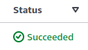
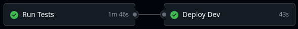

# Data Warehouse Pipeline for TerrificTotes


 

An automated, monitored ETL (Extract, Transform, Load) pipeline for fictional tote manufacturer TerrificTotes.

## 🌐 Overview

TerrificTotes's existing commercial and production systems store data in a write-optimized PostgreSQL database, unsuited to querying by analysts. `gb-terrifictotes-dcf` spins up a complete ecosystem of AWS cloud services in order to process new data from this database at regular intervals. Data is: 

- ingested for storage in JSON files; 
- denormalized and transformed into a new, OLAP-friendly schema, saved in parquet format; and finally 
- loaded into a data warehouse, ready for querying and integration into BI dashboards.

Change history is maintained from the moment of the pipeline's first operation. All stages are monitored, and basic error reporting triggers email notifications on system failure.

## 🫛 Team GreenBeans

[`gb-terrifictotes-solutions`](https://github.com/dulle90griet/gb-terrifictotes-solutions) (🔒) was developed in November 2024 by [@Rmbkh](https://github.com/Rmkbh), [@dulle90griet](https://github.com/dulle90griet), [@contiele1](https://github.com/contiele1), [@ali-shep](https://github.com/ali-shep) and [@Minalpatil3](https://github.com/Minalpatil3).

[`gb-terrifictotes-dcf`](https://github.com/dulle90griet/gb-terrifictotes-dcf) is a comprehensive refactoring of that project by [@dulle90griet](https://github.com/dulle90griet). For an overview of current progress, [see below](#refactor-roadmap).

## 🛣️ Refactor Roadmap

- 🚛 Create S3 bucket backup tool for pipeline migration | ✔️ Dec 3 2024
- 🔧 Create SQL script to initialize data warehouse | ✔️ Dec 4 2024
- 💚 Fix CI build making unusable layer zip | ✔️ Dec 4 2024
- ✅ Add missing tests on ingestion functions | ✔️ Dec 11 2024
- ♻️ Refactor and reorganise ingestion Lambda | ✔️ Dec 11 2024
- ✅ Add missing tests on processing functions | ✔️ Dec 14 2024
- ♻️ Refactor and reorganise processing Lambda | ✔️ Dec 14 2024
- 🚧 Add missing tests on uploading functions | 👷‍♂️ In progress
- 🚧 Refactor and reorganise uploading Lambda | 👷‍♂️ In progress
- Establish consistency of logging
- Rationalize nomenclature
- Remove all deprecated code and modules

## 📜 Prerequisites

This project requires:

1. Python (3.9 <= version <= 3.12.4)

2. The [git CLI](https://git-scm.com/downloads)

3. [Terraform](https://developer.hashicorp.com/terraform/tutorials/aws-get-started/install-cli) (developed using version 1.10.2)

4. An [AWS account](https://aws.amazon.com/free/)

5. [AWS credentials configured locally](https://docs.aws.amazon.com/cli/latest/userguide/cli-chap-configure.html), including access keys and default region

6. An [S3 bucket](https://aws.amazon.com/s3/) for remote storage of Terraform state files

7. A PostgreSQL OLTP database organized according to the proper schema (see [#Demo](#Demo)), accessible remotely via public IP or URL and receiving frequent ongoing updates

8. A second PostgreSQL database, accessible remotely via public IP or URL, which will be used for the data warehouse

## ⚙️ Setup

### 🏗️ Project Setup

[Fork the repository](https://docs.github.com/en/pull-requests/collaborating-with-pull-requests/working-with-forks/fork-a-repo?platform=linux&tool=webui) on GitHub.

Clone it to your local system.

```sh
git clone https://github.com/YOUR-USERNAME-HERE/gb-terrifictotes-dcf
```

Change into the directory.

```sh
cd gb-terrifictotes-dcf
```

Install dependencies and set up the development environment.

```sh
make requirements && make dev-setup
```

### 🔐 Secure Credentials Setup

[Create two AWS Secrets Manager secrets](https://docs.aws.amazon.com/secretsmanager/latest/userguide/hardcoded.html#hardcoded_step-1), both in the following format. In one secret store credentials for the OLTP PSQL database. In the other store credentials for the data warehouse.

```json
{
  "PG_USER": "YOUR_USERNAME_HERE",
  "PG_PASSWORD": "YOUR_PASSWORD_HERE",
  "PG_HOST":"YOUR_PSQL_IP_OR_URL_HERE",
  "PG_DATABASE":"YOUR_DATABASE_NAME_HERE",
  "PG_PORT":"5432"
}
```

In `src/ingestion_lambda.py`, update `connect_to_db()` with the name of the secret containing the OLTP credentials.

```python
credentials = retrieve_secret(sm_client, "YOUR-OLTP-SECRET-NAME-HERE")
```

In `src/uploading_lambda.py`, similarly update `connect_to_db()` with the name of the secret containing the data warehouse credentials.

```python
credentials = retrieve_secret(sm_client, "YOUR-DW-SECRET-NAME-HERE")
```

[Create three GitHub Actions secrets](https://docs.github.com/en/actions/security-for-github-actions/security-guides/using-secrets-in-github-actions#creating-secrets-for-a-repository) to store the AWS credentials already used in your [project configuration](#prequisites), namely:

1. `AWS_ACCESS_KEY_ID`
2. `AWS_SECRET_ACCESS_KEY`
3. `AWS_REGION`

### 🌋 Terraform Setup

In `terraform/main.tf`, update `backend "s3"` to refer to your [S3 remote state bucket](#prequisites) and AWS region.

```hcl
terraform {
  required_providers {
    aws = {
      source  = "hashicorp/aws"
      version = "~>5.0"
    }
  }

  backend "s3" {
    bucket = "YOUR-BUCKET-NAME-HERE"
    key    = "terraform.tfstate"
    region = "YOUR-AWS-REGION-HERE"
  }
}
```

In `terraform/vars.tf`, first update `project-prefix` to a unique prefix for your fork's variables.

```hcl
variable "project_prefix" {
  type    = string
  default = "YOUR-CHOSEN-PREFIX-" 
}
```

Then update `error-alerts-recipient` to give the email address you'd like to receive automatic error notifications.

```hcl
variable "error-alerts-recipient" {
  type    = string
  default = "YOUR.EMAIL.ADDRESS@HERE.COM" 
}
```

### 🚀 Testing and Deployment

To run full checks, including safety, linting, testing and coverage, run:

```sh
make run-checks
```

If you wish to run individual tests – though it shouldn't be necessary for the purposes of initial setup and deployment – use the following command:

```sh
source ./venv/bin/activate && pytest -vvvrP test/TEST_FILE_NAME_HERE.py
```

Deploy the full AWS cloud pipeline using Terraform as follows.

Change into the terraform directory.

```sh
cd terraform
```

Initialise terraform, then plan and apply.

```sh
terraform init
terraform plan
terraform apply
```

Navigate to [Step Functions](https://console.aws.amazon.com/states) in the AWS Console, and click on the newly created state machine. Provided your databases are correctly set up and the IAM user associated with your credentials has all the necessary permissions, you should see a successful execution of the pipeline.

<p align="center"></p>

Subsequent pushes to the `main` branch of the GitHub repo will trigger a CI/CD pipeline in GitHub Actions, once again linting, checking and testing the code and deploying any changes to AWS using `terraform apply`.

<p align="center"></p>
